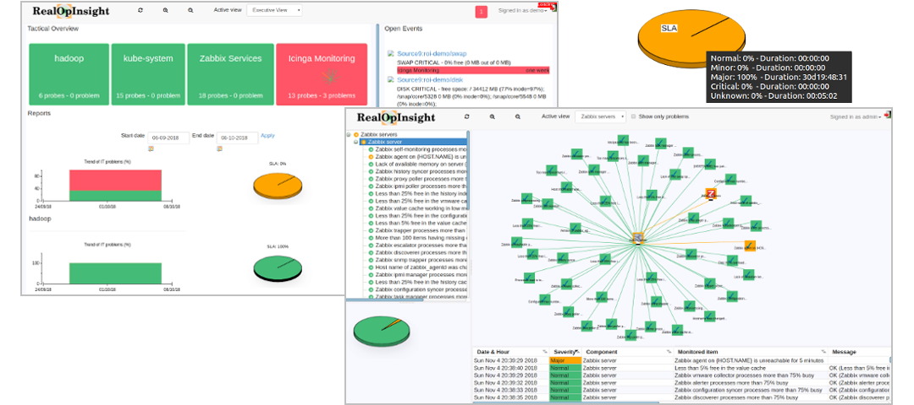

# Overview
RealOpInsight allows to monitor, measure and observe end-user applications availability atop of Kubernetes®, Zabbix®, Nagios®. It features application-specific knowledges to aggregate and handle the status of low-level probes in a way that is meaningful for any targeted end-user application.

- [Overview](#overview)
- [Key Features](#key-features)
- [Quick Start](#quick-start)
    - [Deployment on kubernetes](#deployment-on-kubernetes)
    - [Deployment on Docker](#deployment-on-docker)
    - [Getting Started](#getting-started)
- [Contributions](#contributions)
- [Copyrights & License](#copyrights--license)

# Key Features
Fully open source ([GPL v3 Licence](LICENSE)), RealOpinsight features include:
* **Monitor business values, Define & track SLA/SLO targets:** Focus on the applications that underlie your business, set up application-aware notifications, measure, observe and analyze applications availability over time.
* **Federated & unified applications monitoring:** RealOpInsight enables to set up unified applications monitoring views on top of applications and corporate environments that rely on many monitoring systems. Thereby breaking monitoring silos, it boosts the productivity of operations staffs while helping them solving incident with relevant priorities.
* **Relationship mapping & event correlation:** Map relationships among each application components, set up application-specific policies to calculate and propagate the severity of incidents so as to meet your particular incident management needs.
* **Simple and secured integration through API:** Don't waste time on complex or boring configuration tasks, RealOpInsight only requires a read-only access to the API of the monitoring data collection backends (i.e. Kubernetes API, Zabbix API...). It's released as Docker images along with Kubernetes Helm3 manifests to ease its deployment.
* **Tactical Operations Dashboards:** Whether you're an operations staff or executive, RealOpInsight allows to build user-specific tactical dashboards that allow you to have a quick insight on how your applications are operating while be able to have more details in one click.



# Quick Start
RealOpInsight is released as Docker images along with Kubernetes Helm3 manifests to ease its deployment.

The below sections show how to set an instance of RealOpInsight in a couple of seconds on Kubernetes or on an [OCI](https://opencontainers.org/)-compliant container engine (Docker, Podman, CRI-O, etc).

## Deployment on Kubernetes
Assuming you have a Linux terminal with Helm3 installed and able to access a KUBECONFIG file to deploy resources on Kubernetes, the following command shall install an instance in the `monitoring` namespace. **The namespace must exist**, it can be changed to another value.

```
helm upgrade \
  --namespace monitoring \
  --install realopinsight \
  helm/realopinsight/
```

By default the Helm manifests also deploy a **ClusterIP** service named `realopinsiht` to expose the UI on port `80` and Prometheus metrics on port `4584`. The associated in-cluster URLs are the following:
  * UI: `http://realopinsight.monitoring/ui`.
  * Prometheus metrics: `http://realopinsight.monitoring:4583/metrics`.

## Remote access to the UI
To get a remote access to the UI, use one of the following options:
  * Change the service type to **LoadBalancer** (see [Helm value files](helm/realopinsight/values.yaml));
  * Enable an Ingress access (see [Helm value files](helm/realopinsight/values.yaml));
  * Enable port-forwarding from your local machine as follows (change the namespace if different).
    ```
    kubectl port-forward \
      --namespace monitoring \
      service/realopinsight-ui 4583:80
    ```
    Then point your browser at the following address: http://localhost:4583/ui/.

## Deployment on Docker
The following command shall pull the image and start an instance of RealOpInsight in background. The `-d` option can be removed to start the instance in foreground.
With this command the data of the instance will be stored locally on the Docker machine at the specified path (value of option `--volume`, can be changed if needed).

```
$ docker run -d \
  --name realopinsight \
  --network host \
  --volume $HOME/.realopinsight:/opt/realopinsight \
  rchakode/realopinsight
```

Once the container started, it shall enable the following endpoints:
 * UI: `http://localhost:4583/ui`.
 * Prometheus metrics: `http://localhost:4584/metrics`.

## Default admin credentials
The default username and password for the UI are `admin` and `password`.

> For a production setup, you must change this default password as quick as possible.

## Configuration and next steps
Consider the following resources to start integrating RealOpInsight with your target monitoring environment.
* [Architecture & Supported Monitoring Sources](https://realopinsight.com/docs/monitoring-data-sources/)
* [Integration with Kubernetes](https://realopinsight.com/docs/quickstart-kubernetes-dashboard/)
* [Integration with Zabbix](https://realopinsight.com/docs/quickstart-zabbix-dashboard/)
* [Integration with Nagios and related systems](https://realopinsight.com/docs/quickstart-nagios-icinga-centreon-dashboard/)

# Contributions
Contributions in any form (feedback, code, documentation...) are welcome.

For code contributions it's required to have skills in writing code in C+11 or later.

The software also includes [Qt](https://www.qt.io/) and [Wt](https://www.webtoolkit.eu/wt) at it core. Having fundamentals to develop software using this frameworks may be helpful, but not required.

# Copyrights & License
This project has been initiated by Rodrigue Chakode and open to contributions.

Contributions in any form (code, documentation...) must be aligned and compliant with the following terms.

The software is licensed under the terms of [GPLv3 License](LICENSE), mainly due to contamination by third-party systems that the software is bound to. All those third-party systems may offer dual licenses (e.g. for proprietary uses), subject to pay some license fees. You can contact us you're interested in such a use.
